# Submission

## Short Description

# Submission

## Short Description

A prediction markets web application similar to Polymarket or Kalshi, built on top of the provided starter project.

**Stack:** Bun + Elysia + SQLite + Drizzle ORM (backend), React + TanStack Router + shadcn/ui + Tailwind CSS (frontend)

---

## Features Implemented

- **Task 1 — Main Dashboard:** Sorting by date/total bets/participants, filtering by status, pagination (20/page), real-time updates every 10 seconds
- **Task 2 — User Profile Page:** Active bets with live odds, resolved bets with won/lost status, separate pagination for each list
- **Task 3 — Market Detail Page:** Pie chart showing bet distribution per outcome using Recharts
- **Task 4 — Leaderboard:** Users ranked by total winnings with medal emojis for top 3
- **Task 5 & 6 — Role System & Admin Resolution:** Admin role via `isAdmin` boolean field, admins can resolve markets or archive them and return funds
- **Task 7 — Payout Distribution:** Winners receive proportional share of the total bet pool based on their stake
- **Task 8 — User Balance Tracking:** Users start with $1000, balance deducted on bet, updated in real-time in the header
- **Bonus — API Key:** Users can generate an API key from their profile and use it programmatically via `Authorization: ApiKey YOUR_KEY`

---

## Design Choices

**Polling for real-time updates:** Used `setInterval` every 10 seconds instead of WebSockets or SSE. Simple, reliable, and sufficient for this use case.

**isAdmin as boolean:** A simple boolean field on the users table instead of a separate roles table, sufficient for a two role system. The seed file was modified to set alice as admin by default, so no manual setup is required after `bun run db:reset`.

**updateBalance in auth context:** After placing a bet, the balance updates instantly in the header using the `newBalance` value returned by the server, without requiring a page refresh or re-fetch.

**Offset-based pagination:** Simple to implement and sufficient for this dataset size.

---

## Challenges

**Drizzle ORM multiple relations error:** Using `with: { bets: true }` threw a "multiple relations" error due to conflicting relation names in the schema. Solved by fetching bets separately with explicit `where` clauses.

**Real-time balance updates:** After placing a bet, the balance in the header needed to update without a full page reload. Solved by adding an `updateBalance` function to the auth context that updates both React state and localStorage simultaneously, using the `newBalance` value returned directly by the server.

**Balance calculation:** The server was returning `user.balance - amount` using the balance cached in memory from authentication time, which could be stale. Fixed by fetching the updated balance directly from the database after the bet is placed and returning that value instead.

## Images or Video Demo
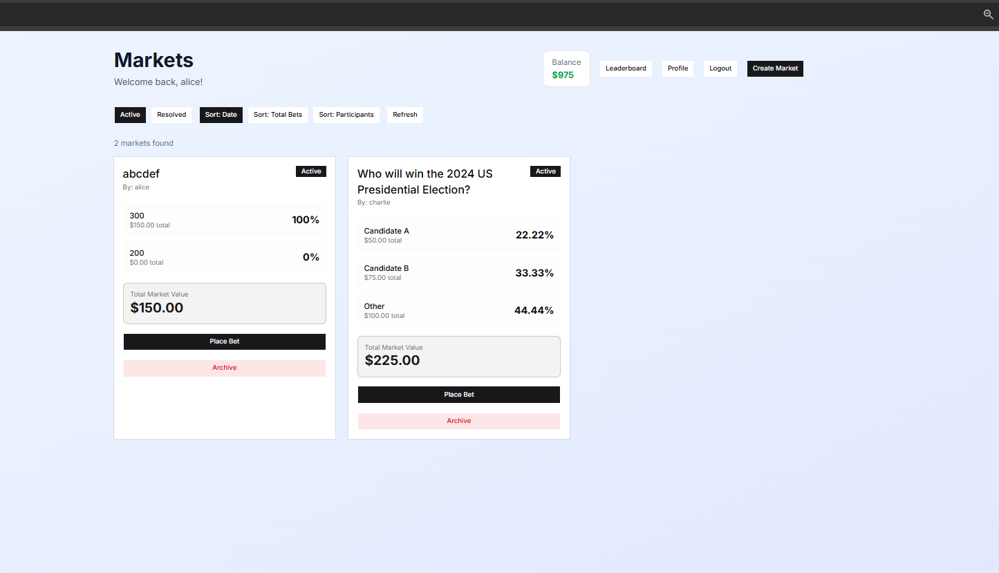

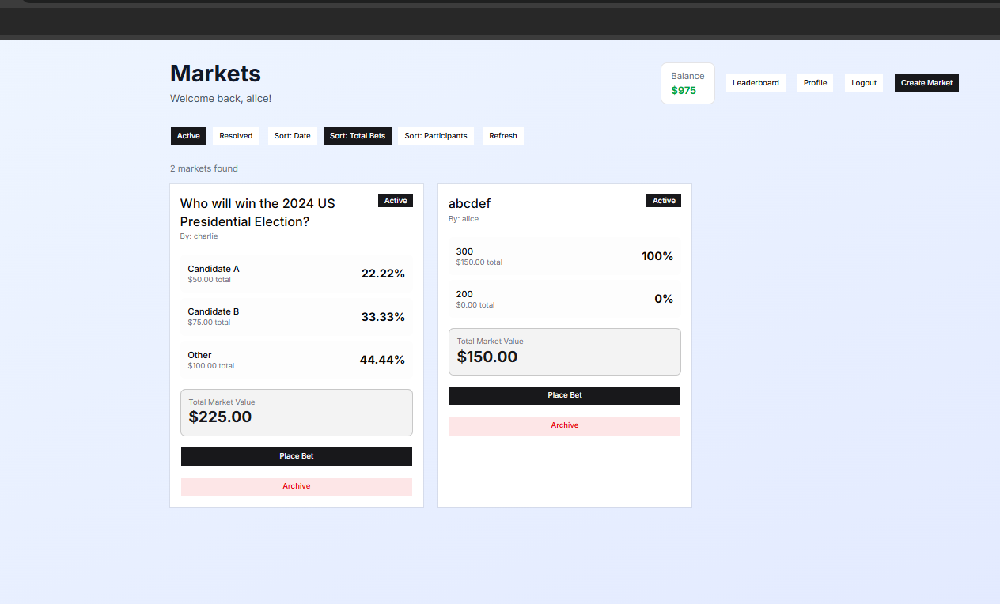

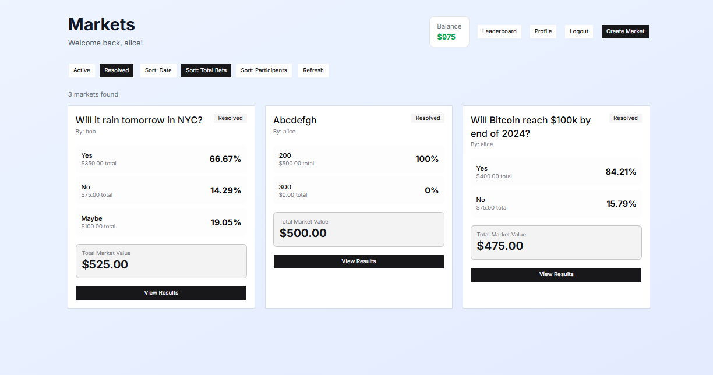

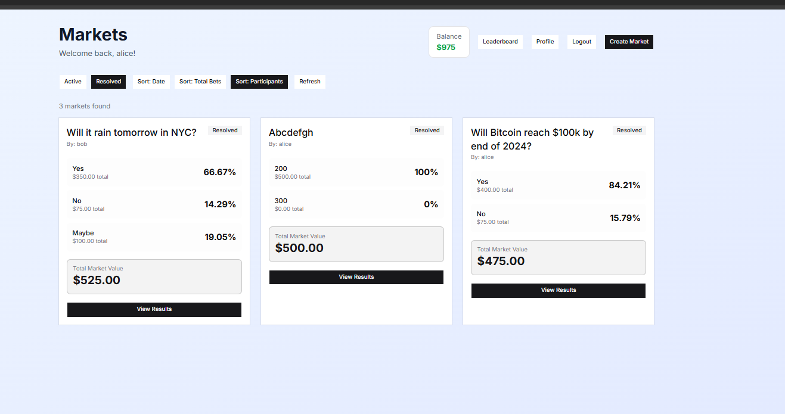

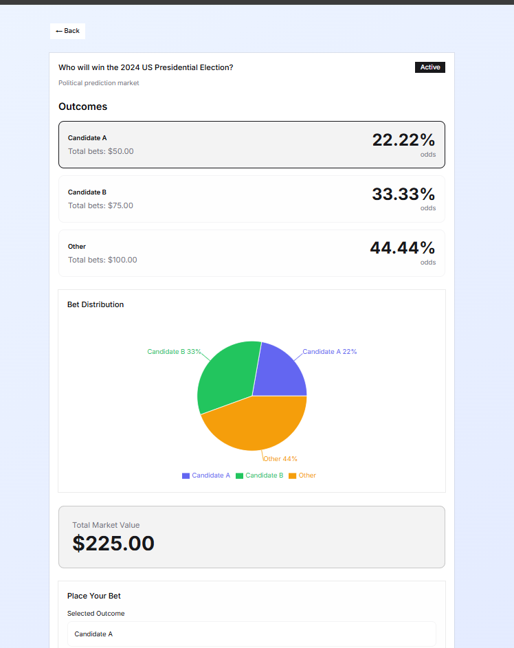

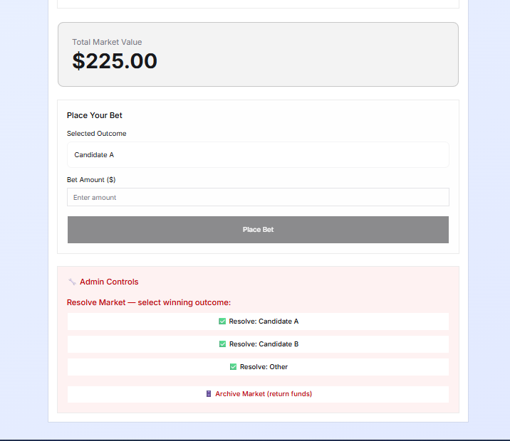

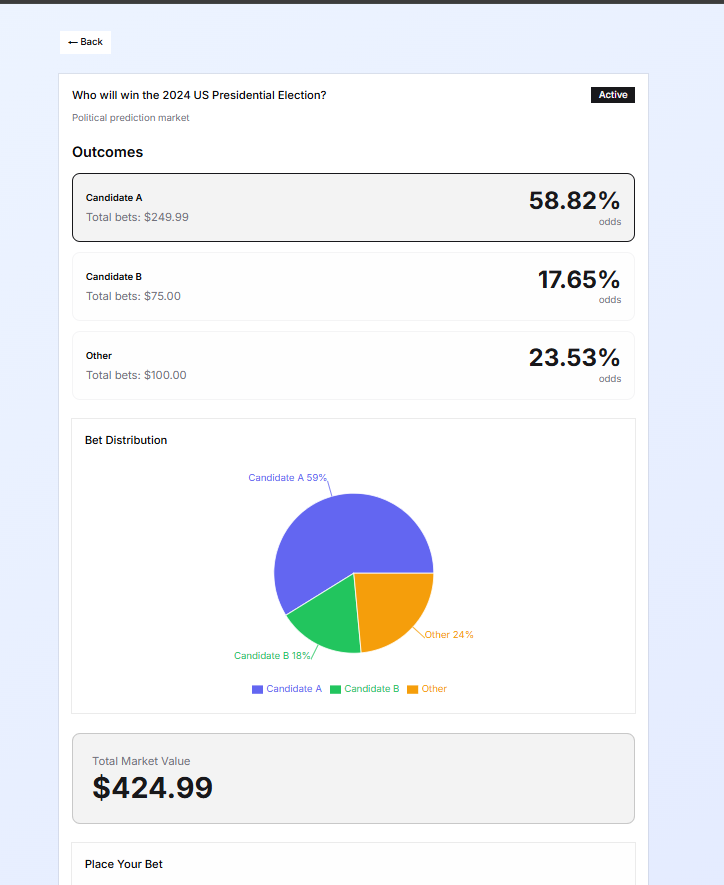

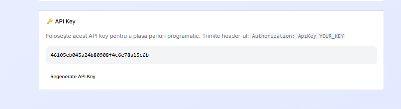

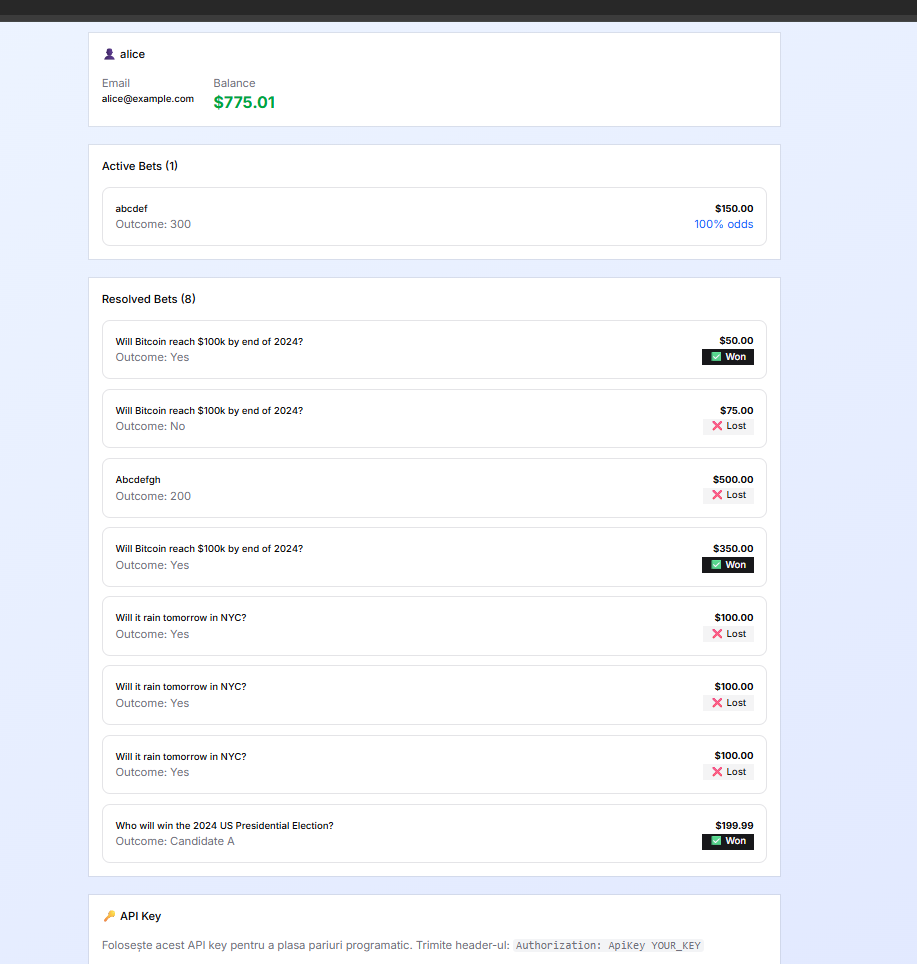

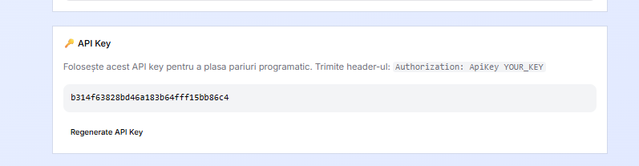

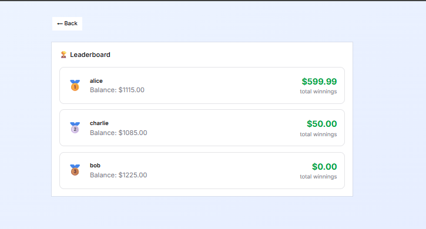
